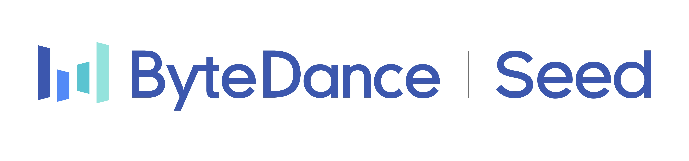
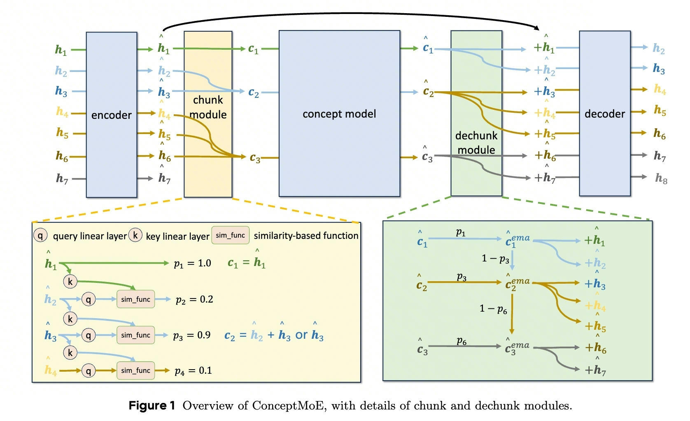
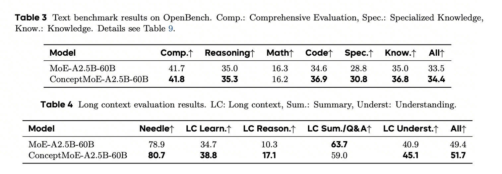
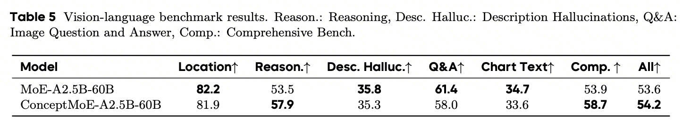
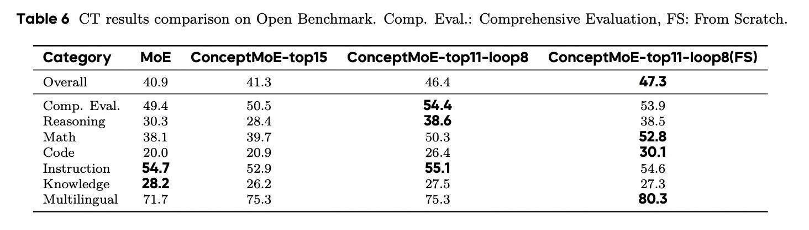
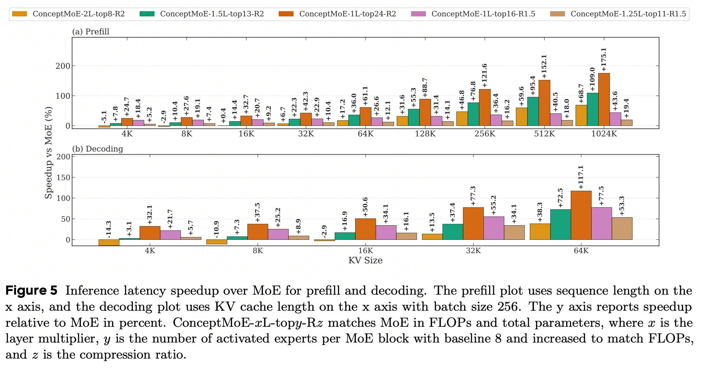

# ConceptMoE: Adaptive Token-to-Concept Compression for Implicit Compute Allocation

[](https://arxiv.org/abs/2601.21420)

Official implementation of **ConceptMoE: Adaptive Token-to-Concept Compression for Implicit Compute Allocation**.

ConceptMoE elevates language model processing from token level to concept level through learnable adaptive chunking. By dynamically merging semantically similar tokens into unified concepts, ConceptMoE achieves superior performance while reducing computational costs.




## 🔥 Highlights

- **Adaptive Concept-Level Processing**: Automatically merges predictable token sequences while preserving fine-grained computation for complex tokens
- **Superior Performance**: +5.5 points improvement on continual training, +6.4 from scratch
- **Significant Speedup**: Up to 175% prefill speedup and 117% decoding speedup at R=2
- **Easy Integration**: Minimal architectural changes enable straightforward deployment in existing MoE systems

## 📊 Key Results

### VLM Benchmark Results

We extend ConceptMoE to vision-language models (MoE-A2.5B-60B) with dual-modality compression at R=2. The model automatically adapts compression across modalities: compressing text less (higher compute) and images more (higher redundancy). Results show +0.9 points on text benchmarks, +2.3 on long context (benefiting from reduced sequence length), and +0.6 on multimodal tasks. Strong gains in reasoning and understanding validate concept-level processing, though fine-grained visual localization tasks show slight degradation, likely because sequential token processing disrupts spatial relationships. This demonstrates ConceptMoE's versatility beyond language-only models.





### Continual Training Results
We demonstrate practical deployment by converting pretrained MoE-A2.5B-90B (700B tokens) to ConceptMoE during continual training. Adding only a chunk module, dechunk module, and QKV projectors in the final 4 layers, we continue training with 400B tokens at 32k context, 40B at 128k, and 3B SFT tokens. At conservative R=1.5, two strategies are explored: ConceptMoE-top15 (activating 15 experts) maintains baseline performance (+0.4), while ConceptMoE-top11-loop8 (11 experts plus 8 looped layers) achieves substantial +5.5 points gain, with particularly strong improvements in reasoning (+8.3), math (+12.2), and code (+6.4). Training from scratch adds another +0.9 points (+6.4 overall). This validates lossless integration into existing systems while enabling direct inference speedup (prefill +43.6%, decoding +53.3%).



## 🚀 Inference latency

We evaluate inference latency using MoE baseline across five ConceptMoE configurations ranging from efficiency-oriented to quality-oriented setups. Even when doubling layers at R=2, ConceptMoE achieves comparable speed to baseline on short sequences while maintaining increasing advantages on long contexts, thanks to R²× reduction in attention map computation and R× reduction in KV cache. Efficiency-oriented configurations (keeping layer count unchanged) deliver prefill speedups up to 175.1% and decoding speedups up to 117.1% at R=2. At R=1.5 (matching our CT experiments), we observe prefill speedups up to 43.6% and decoding speedups up to 53.3%, enabling direct deployment of CT-converted models with significant efficiency gains.




## Quick Start

```python
python3 ConceptMoE_demo.py
```

## 📝 Citation

If you find ConceptMoE useful in your research, please cite:
```bibtex
@article{conceptmoe2025,
  title={ConceptMoE: Adaptive Token-to-Concept Compression for Implicit Compute Allocation},
  author={Zihao Huang and Jundong Zhou and Xingwei Qu and Qiyang Min and Ge Zhang},
  journal={arXiv preprint arXiv:2601.21420},
  year={2026}
}
```
